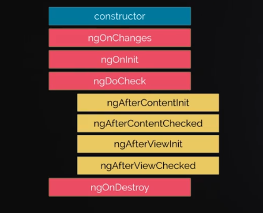

# CURSO DE ANGULAR

## INTRODUCCIÓN A ANGULAR

### Bienvenida e introducción al curso

El objetivo del curso es crear apliaciones con las buenas prácticas, conociendo cada uno de los artefactos, herramientas y su ecosistema que ofrece Angular, al final podrás crear aplicaciones de gran calidad para poner a producción.

Angular ahora suele ser conocido más como una plataforma debido a que permite lo siguiente:

- Aplicaciones web progresivas.
- Formularios reactivos.
- Hacer testing.
- Utilizar el sistema de diseño material design para diseñar las aplicaciones.

### Instalación y preparación del entorno de desarrollo

- Node JS > 12
- Angular CLI > 8

### Crea tu primera aplicación en Angular

> ng new 'project-name'
> ng serve

## ESTRUCTURAS DE CONTROL

### Introducción al Angular CLI y proyecto del curso

Para verificar la versión acutual de Angular cli es posible ejecutar:

> ng --version

Para correr el servidor en un entorno de desarrollo se debe ejecutar:

> ng serve

Adicional, pueden enviarse banderas para indicar el puerto, host y otros.

Para compilar el proyecto para un entorno productivo se debe ejecutar:

> ng build --prod

### String interpolation

**String Interpolation** sirve para renderizar variables {{ variableName }} que contiene TS que se ejecuta por angular y la salida se inserta en el HTML.

Entonces, si colocamos `{{ 1 + 1 }}` la plantilla, el número **2** se insertaría en el HTML.

### Data binding en Angular

Un **enlace de datos** o **data binding** consiste en el proceso de enlazar los datos desde el componentes hasta el template.

### Directiva ngIF

Permite realizar condicionales dentro de un template.

### Uso de ngFor add y delete

Permite iterar arreglos en el template, además de conocer el índice de iteración.

```javascript
<div *ngFor="let product of products">
  {{ product.title }}
  
  {{ product.price }}
</div>
```

### Uso de ngSwitch

Cuando tenemos if anidados ens conveniente realizar un switch que haga match a los diferentes casos.

```javascript
<div [ngSwitch]="title">
  <p *ngSwitchCase="'aaron'">Titulo es aaron</p>
  <p *ngSwitchCase="'kathe'">Titulo es kathe</p>
  <p *ngSwitchCase="'mike'">Titulo es mike</p>
  <p *ngSwitchDefault>No hay match</p>
</div>
```

## COMPONENTES

### Componentes y decoradores

- Decoradores: Un decorador angular es una clase especial de declaración que puede acoplarse a una clase, método, propiedad o parámetro. Los decoradores se declaran de la siguiente manera @expression. Gracias al parámetro @ podemos reconocer fácilmente que estamos hablando de un decorador.

- Generalmente usamos los decoradores para extender servicios de terceros, de esta manera evitamos modificar el código original del módulo y en tiempo de ejecución agregamos el funcionamiento que necesitamos.

### Uso de Inputs y Outputs

Permiten enviar y recibir datos desde un componente; esto en angular se conoce como **property binding** y **event binding**.

#### Input

Para comunicar de un componente padre a un componente hijo usamos **Input**.

```javascript
export class ProductComponent {
  @Input() product: Product; // Equivalente a prop, dónde le vamos a pasar la data al componente
}
```

Para pasar argumentos, desde el template padre podemos utilizar los corchetes cuadrados con el **Input** para pasar el argumento

```html
<app-product [product]="products[0]"></app-product>
<div *ngFor="let product of products">
  <app-product [product]="product"></app-product>
</div>
```

#### Output

Para comunicar de un componente hijo a un componente padre usamos **Output**. Los **Output** son eventos que podemos cachar desde nuestro componente hijo por parte del padre.

Para declararlos en nuestro componente tenemos que usar el decorador **@Output** sobre un **EventEmitter**.

```javascript
export class ProductComponent {
@Output() clickAddToCart = new EventEmitter<any>(); // (clickAddToCart)= eventHandler(\$event):function
...
}
```

Los \*_EventEmmiter_ pueden emitir un evento con un argumento que será recibido por el padre.

```javascript
export class ProductComponent {
  @Output() clickAddToCart = new EventEmitter<any>(); // (clickAddToCart)= eventHandler(\$event):function
  addToCart() {
    this.clickAddToCart.emit(this.product.id)
  }
}
```

Para hacer uso del **output** podemos llamar el evento desde paréntesis y asignarle un **evento** `(clickAddToCart)="handler(\$event)"`:

```javascript
// Componente padre
export class AppComponent {
  ...
  handleProductAddToCart(id: number) {
  console.log('product -> id', id);
  }
}
```

```html
// Template del componente padre
<app-product (clickAddToCart)="handleProductAddToCart(\$event)"> </app-product>
```

El event es recibido desde el **emit** del **EventEmmiter** :

```javascript
this.clickAddToCart.emit(this.product.id);
```

### Ciclo de vida de los componentes

En ciclo de vida de un componente corresponde al ciclo en el que es coloado en la interfaz hasta que es eliminado de la misma.

Angular contiene unos eventos que ejecuta en un orden en específico haciendo el ciclo de vida de un componente.



1. **constructor**:
   - Crea el componente y lo pone en la interfaz.
2. **ngOnChanges**:
   - Detecta el cambio cada vez ue ponemos un input.
3. **ngOnInit**:
   - Se ejecuta una vez se inicializa el componente.
   - Es el lugar ideal para hacer llamadas a componentes como una **REST API**.
4. **ngDoCkeck**:
   - Detecta cuando los elementos hijos son creados y puestos en interfaz.
   1. ngAfterContentInit.
   2. ngAfterContentChecked.
   3. ngAfterViewInit.
   4. ngAfterViewChecked.
5. **ngOnDestroy**:
   - Detecta cuando el componente es eliminado de la interfaz.

### Uso de ng generate y ng lint

Los generandores son una funcionalidad del cliente de angular que nos ayuda a ser mucho más productivos.

> ng lint

Revisa el código del proyecto para ver si se están cumpliendo las reglas definidas en el archivo tslint.json

> ng lint --format json

Nos permite visualizar el resultado de la revisión con un formato json.

> ng lint --fix

Corrige automáticamente, dentro de lo posible, los errores encontrados.

### Usando los pipes de Angular

Los pipes en Angular son transformaciones que se le puede hacer a un dato dentro de una **template-expression** sirve para formatear data como se desee.

Los pipes pueden ser anidados, por lo que puede ser bastante poderoso.

La sintaxis es `{{ variableName | pipeName:argumentos }}`

Nosotros podemos crear nuestros pipes, pero Angular por defecto provee muchos pipes que podemos implementar sin muchas complicaciones, mismos que pueden ser configurables en el app.module.ts éstos son los comunes:

- [AsyncPipe](https://link)
- [CurrencyPipe](https://link)
- [DatePipe](https://link)
- [DecimalPipe](https://link)
- [I18nPluralPipe](https://link)
- [I18nSelectPipe](https://link)
- [JsonPipe](https://link)
- [KeyValuePipe](https://link)
- [LowerCasePipe](https://link)
- [PercentPipe](https://link)
- [SlicePipe](https://link)
- [TitleCasePipe](https://link)
- [UpperCasePipe](https://link)

Para agregar localismos a nuestros pipes (en este caso mexicanos) tendríamos que agregar el idioma a un provider dentro de app.module.ts de la siguiente forma:

```javascript
...
import { LOCALE_ID } from '@angular/core';
import localeEs from '@angular/common/locales/es';
import { registerLocaleData } from '@angular/common';

registerLocaleData(localeEs);
...

@NgModule({
 ...
 providers: [ { provide: LOCALE_ID, useValue: 'es-mx' } ],
 ...
})
export class AppModule { }
```

### Construyendo un propio pipe

A través de angular cli puede generarse de la siguiente forma:

> ng generate pipe **name**
> ng g pipe **name**

En la estructura del código puede definirse de la siguiente manera:

```javascript
import { Pipe, PipeTransform } from "@angular/core";

@Pipe({
  name: "exponential",
})
export class ExponentialPipe implements PipeTransform {
  transform(value: number): any {
    return Math.pow(value, 2);
  }
}
```

### Construyendo una directiva propia

Las directivas también son un artefacto importante dentro de Angular que nos para modificar el DOM de un elemento en la específico.

> ng generate directive **name**
> ng g d **name**

Las directivas tienen un selector que es como su identificador el cual se debe colocar en las etiquetas como atributos.

```javascript
selector = ‘[appTabRequired]’
```

En el constructor tendremos que hacer la inyeccion de dependencia **ElementRef**

```javascript
constructor( element: ElementRef) {
element.nativeElement.style.color = 'red';
}
```

## MODULOS Y RUTAS

### Introducción al NgModule

Nos sirven para abstraer y dividir mejor por dominio nuestra aplicación.

En angular tenemos dos **módulos especiales** que son:

- **Core**: Guarda toda la funcionalidad de la aplicación que va a ser compartida, es decir que genera una sóla referencia de la funcionalidad, siguiendo el principio Singleton de SOLID, facilitando así el traslado de funcionalidad entre aplicaciones.

- **Shared**: Encapsula los componentes y servicios compartidos para la aplicación.

### Creando rutas en Angular

En el archivo `app-routing-module.ts` se encuentra un objeto `Route` el cual sirve para incrustar las rutas del proyecto.

La sintaxis dentro del router **(app-routing-module.ts)**:

```javascript
import { componentName } from './url/to/componentName.component';

const routes: Routes = [
  {
    path = ‘routeName’,
    component = componentName
  },
]
```

Donde:

- path: ruta relativa al home (’/’) de nuestra app
- component: componente importado desde componentName.component.ts

La forma de implementar el `router` en un `template.html` es con el componente `router-outlet`:

```html
<!-- app.component.html -->
<router-outlet></router-outlet>
```

Donde el `router-outlet` se reemplazará por el contenido del componente según la URL.

#### Página no encontrada

Para definir una página no encontrada podemos utilizar la ruta `**` que simboliza cualquier ruta diferente a las anteriormente definidas, el componente también deberá de ser el objeto del componente importado.

```javascript
  {
    path: '**',
    component: NotFoundComponent
  }
```

- **Nota**: El orden de las rutas es importante, si algo matchea una ruta, no se segirá a la siguiente, por lo que el not-found, debería de ser la última ruta, siempre.

#### Redirecciones

Para las redirecciones tenemos que usar las propiedades `redirectTo:'route'` y `pathMatch:'full'`.

```javascript
  {
    path: 'from',
    redirectTo: 'to',
    pathMatch: 'full'
  },
```

Donde:

- path: Página actual
- redirectTo: página a la que se redireccionará
- pathMatch: tipo de match, en el caso de ‘full’ será con una relación exacta

#### Redirecciones sin recargar routerLink

Para poder movernos entre rutas sin recargar nuestra página (tipo single page application) debemos agregar a nuestras anclas `<a>` la directiva routerLink del atributo reemplaza al atributo href para que Angular determine que no haga una recarga de la página.

```html
<div>
  <a routerLink="/home">Home</a>
  <!-- Antes <a href="/home">Home</a> -->
</div>
```

#### Ancla activa routerLinkActive

Puedes definir una clase para cuando una ruta matchee completamente al agregar la directiva routerLinkActive, misma que agregará una clase al elemento que contenga un routerLink, de esta manera en los estilos podrás acceder al elemento seleccionado.

La recomendación es llamar “active” al routerLinkActive (routerLinkActive="active">), de esta manera podrás acceder desde el css mediante la clase .active

```html
<nav>
  <a routerLink="/home" routerLinkActive="active">Home</a>
  <a routerLink="/products" routerLinkActive="active">Products</a>
  <a routerLink="/contact" routerLinkActive="active">Contact</a>
</nav>
```

#### scss

```css
nav a {
  padding: 5px;
  text-decoration: none;
  &.active {
    background-color: papayawhip;
  }
}
```

Así se vería un app-routing.module.ts completo:

```javascript
... // importaciones
const routes: Routes = [
  {
    path: 'home',
    redirectTo: '',
    pathMatch: 'full'
  },
  {
    path: '',
    component: HomeComponent
  },
  {
    path: '**',
    component: NotFoundComponent
  },
];

@NgModule({
  imports: [RouterModule.forRoot(routes)],
  exports: [RouterModule]
})
export class AppRoutingModule { }
```

### Vistas Anidadas

A veces existen componentes que se utilizan en varios otros componentes, para esto existe la técnica de vistas anidadas, la cual consiste en crear un componente que albergue los elementos que se repiten y los otros componentes que los utilizan serán rutas hijas del componente creado anteriormente.

Primero creamos el componente que almacena los elementos con el comando `ng g c nombreComponente`.

Luego en los archivos del componente se almacenan los elementos que se utilizaran repetitivamente en otros componentes. En el archivo html se utiliza la etiqueta router-oulet para renderizar los componentes que se quieren cargar, y los elementos repetitivos se especifican.

```html
<app-header></app-header>
<router-outlet></router-outlet>
<app-footer></app-footer>
```

En el archivo routing se incorpora el componente creado anteriormente en la variable de routes, pero esta vez todos los componentes que se basen en este deberán estar anidadas. Para anidarlos el objeto del componente creado tendrá que tener una nueva característica **children**, el cual tendrá los **path** y **component** de las rutas que se basen en la anterior.

```javascript
const routes: Routes = [
  {
    path: "",
    component: LayoutComponent,
    children: [
      {
        path: "",
        redirectTo: "/home",
        pathMatch: "full",
      },
      {
        path: "home",
        component: HomeComponent,
      },
      {
        path: "products",
        component: ProductsComponent,
      },
      {
        path: "products/:id",
        component: ProductDetailComponent,
      },
      {
        path: "contact",
        component: ContactComponent,
      },
    ],
  },
  {
    path: "demo",
    component: DemoComponent,
  },
  {
    path: "**",
    component: PageNotFoundComponent,
  },
];
```

### Preparar el proyecto para Lazy Loading

Ésta técnica se encarga de fragmentar el archivo generado `main.js` para que cargue más rápido la aplicación, basada en la técnica `divide y vencerás`, cargando siempre el código JavaScript necesario para que la vista funcione de manera adecuada.

Con ésto claro, un pre-requisito fundamental es modularizar la aplicación. Un módulo encapsula varios elementos de la aplicación (components, directivas, servicios, etc)

Modularizando home:

- Crear archivo home/home.module.ts
  > ng g module components/home
- Crear carpeta home/components
- Copiar y pegar los componentes que el módulo home va a utilizar
- Eliminar el componente del array de declarations de otros módulos e importarlo al módulo creado
- Crear el routing para el módulo Home. En angular cada módulo debe tener un routing
  > cd src/app/components/home
  > ng g module home-routing --flat --module=home

### Lazy Loading

Es una técnica que ayuda a reducir el peso de las aplicaciones, de esta forma carga mas rápido el proyecto.

La forma en que funciona es que el navegador realiza un request del html, el cual contiene las instrucciones de carga (archivos css, js e imágenes) y cuando identifica los archivos que necesita para cargar el modulo, realiza otro request para pedir dichos archivos. Para aplicar esta técnica es necesario modularizar la aplicación.

Cuando ya esta modularizado, hay que definir una ruta inicial en el archivo routing del modulo.

```javascript
import { HomeComponent } from "./components/home/home.component";

const routes: Routes = [
  {
    path: "",
    component: HomeComponent,
  },
];
```

Ahora en el app-routing cargamos la ruta del modulo con loadChildren, de esta forma se carga dinámicamente. De esta forma resolvemos todo un modulo (no un componente únicamente).

```javascript
const routes: Routes = [
  {
    path: "",
    component: LayoutComponent,
    children: [
      {
        path: "",
        redirectTo: "/home",
        pathMatch: "full",
      },
      {
        path: "home",
        loadChildren: () =>
          import("./home/home.module").then((m) => m.HomeModule),
      },
    ],
  },
  {
    path: "**",
    component: PageNotFoundComponent,
  },
];
```

Ahora tenemos que hacer que la aplicación realice una precarga de los otros módulos de las otras vistas cuando la vista que estamos consultando ya termine. Para realizarlo en el archivo ‘app-routing’ debemos cambiar de estrategia de carga, precargando los archivos con ‘PreloadAllModules’. No olvidar importar ‘PreloadAllModules’

```javascript
import { Routes, RouterModule, PreloadAllModules } from '@angular/router';

@NgModule({
imports: [RouterModule.forRoot(routes, {
preloadingStrategy: PreloadAllModules
})],
exports: [RouterModule]
})
```

### Creando un shared module y core module

#### Shared Module

Módulo compartido, donde se guardan componentes, directivas y pipes, en la cual se necesita importarlo en los otros módulos que seran utilizados.

> Es una buena práctica en el “share module” guardar componentes, directivas y pipes o como tal todas las cuestiones de artefactos graficos.

#### Core Module

Segmenta o agrupa componentes y servicios, si o solo si se van a compartir a traves de toda la aplicación pero solo generando una referencia única. Es decir por defecto va estar en todos los módulos sin necesidad de importarlos.

> DATO: Es una buena práctica en el “core module” guardar solo servicios que tengan una sola referencia de los datos.
> El modulo Core sigue el patrón Singleton. Variable global, una única instancia.

### Guardianes

Nos permiten agregar un nivel de seguridad en el que se puede definir quién puede o no entrar a una ruta en específico.

- **CanActivate** : Mira si el usuario puede acceder a una página determinada.
- **CanActivateChild** : Mira si el usuario puede acceder a las páginas hijas de una determinada ruta.
- **CanLoad** :Sirve para evitar que la aplicación cargue los módulos perezosamente si el usuario no est- autorizado a hacerlo.

## UI/UX Estilos

### Instalando Angular Material

Google porporciona una implementación en Angular para la libreria de Angular Material de fácil implementación con el siguiente comando:

> ng add @angular/material

Es una muy buena práctica crear un módulo independiente para material.

> ng g m material

En `Angular Material` existen componentes pero no un sistema de grillas.

### Sistema de grillas

- En los comentarios recomiendan bastante el uso de [bulma.io](https://bulma.io/).
- En el curso utilizaremos [flexboxgrid](<[https://link](https://bulma.io/)>) debido a que es muy liviano.

> npm i flexboxgrid --save

### Angular Schematic

`Angular Schematic` permite generar interfaces bastantes potentes con sólo una línea de código generada desde la interfaz.

Para crear un módulo que genera inmediatamente el routing se puede utilizar.

> ng g m admin --routing

Para utilizar `Angular schematics` se debe instalar el sigueinte paquete:

> ng add @angular/cdk

Una vez instalado el paquete se pueden crerar components desde el cli utilizando por ejemplo:

> ng generate @angular/material:address-form **component-name**

## FORMULARIOS

### Introducción al FormControl

#### Formularios Reactivos

Los formularios reactivos ayudan a manejar entradas de formulario cuyos valores cambian con un enfoque explícito e inmutable para administrar el estado de un formulario en un momento dado.

Difieren de los formularios basadas en plantillas en los siguientes puntos.

- Las formas reactivas son predecibles al ser síncronas con el modelo de datos.
- Son inmutables, por lo tanto cada cambio en el estado del formulario devuelve un nuevo estado, seguimiento de cambios a través de streams observables.
- Proporcionan una ruta directa a las pruebas porque tiene la seguridad de que sus datos son consistentes y predecibles cuando se solicitan.
- Cualquier consumidor de los streams tiene acceso para manipular estos datos de manera segura.
- Se construyen alrededor de observable streams.

Además proveen métodos más sencillos para:

- La validación de datos.
- Realización de pruebas unitarias: porque tienes la seguridad de que sus datos son consistentes y predecibles al momento de solicitarlos.
- Tener lógicas más complejas

#### FormControl

Un **input** de tipo **FormControl** permite la anidación de validadores (ValidatorFn) con los que podemos de manera sencilla validar la fuente de datos.

```javascript
FormControl(
formState?: any,
validatorOrOpts?: ValidatorFn | ValidatorFn[] | AbstractControlOptions,
asyncValidator?: AsyncValidatorFn | AsyncValidatorFn[]
): FormControl
```

Se definen detro de una variable de tipo FormControl() y se pueden llamar en el template:

```javascript
// component.component.ts
export class Component implements OnInit {
  emailField: FormControl;
  constructor() {
    this.emailField = new FormControl("", [
      Validators.required,
      Validators.maxLength(50),
      Validators.minLength(4),
      Validators.email,
      Validators.pattern(/^[a-zA-Z0-9._-]+@[a-zA-Z0-9.-]+\.[a-zA-Z]{2,6}\$/),
    ]);
  }
}
```

```html
<!-- component.component.html -->

<input type="email" [formControl]="emailField" />
{{ emailField.valid }}
<!-- Imprime true o false si el input es válido -->
```

### Validaciones personalizadas

Pueden ser creados de la siguiente manura siguiente la manera en que Angular contiene sus validators:

```javascript
export class MyValidators {
  static isValidPrice(control: AbstractControl): any {
    const value = control.value;
    console.log(value);
    if (value > 10000) {
      return { price_invalid: true };
    }
    return null;
  }
}
```
